# Multi Threshold Directional Change Optimization using Genetic Algorithms

This repository offers a comprehensive toolkit for exploring and optimizing trading strategies using genetic algorithms and directional change analysis. The primary focus is on developing and evaluating trading strategies through advanced data analysis and machine learning techniques.

## Repository Overview

The repository is organized into several key components:

1. **Trading Strategy Implementations**: The core trading strategies are implemented in the following files:
   - [Strategy 1](./strategy1.py): Implements trading decisions, stock return calculations, and strategy performance evaluation.
   - [Strategy 2](./strategy2.py): Contains functions for trading decisions based on thresholds and stock prices.
   - [Strategy 3](./strategy3.py): Similar to Strategy 1 and 2, with its own unique logic for trading decisions.

2. **Genetic Algorithm Optimization**: The optimization scripts for the trading strategies are found in:
   - [run_ga_*.py](./run_ga_*.py): Python scripts to execute the genetic algorithm optimization.
   - [run_strategy*.sh](./run_strategy*.sh): Shell scripts to set up the necessary environment and parameters for running the optimizations.

3. **Directional Change Analysis Utilities**: Essential utilities for directional change analysis include:
   - [dc.py](./helper/dc.py): Core functions for calculating Directional Change (DC) and related indicators from price data.
   - [extract_ticker_data.py](./helper/extract_ticker_data.py): Functions for fetching stock data.
   - [plot.py](./helper/plot.py): Utility for visualizing results.

## Key Features

- **Modular Code Organization**: The repository is structured to separate data processing, trading strategy implementation, and optimization tasks, enhancing readability and maintainability.
- **Advanced Data Structures**: Utilizes well-defined data structures, such as [`namedtuple`](./strategy1.py#L8), for handling DC events and summaries.
- **Machine Learning Integration**: Leverages popular data analysis and machine learning libraries, including Pandas, Numpy, and Keras, to provide a robust framework for financial analysis and strategy development.

## Directional Change Analysis

The [helper](./helper) directory contains essential files for data processing and Directional Change analysis, including:

- **Directional Change Calculation**:
  - [`calculate_dc()`](./helper/dc.py#L15): Computes DC based on price data and a threshold value.
  - [`calculate_dc_indicators()`](./helper/dc.py#L94): Derives DC indicators from price data.
  - [`compute_all_overshoot()`](./helper/dc.py#L150): Calculates overshoot values.
  - [`split_into_chunks()`](./helper/dc.py#L194): Divides data into chunks.
  - [`compute_threshold_dc_summaries()`](./helper/dc.py#L210): Summarizes DC for each threshold.
  - [`merge_dc_events()`](./helper/dc.py#L234): Combines upturn and downturn events into a single DataFrame.

- **Visualization**:
  - [`plot_price_with_highlight()`](./helper/plot.py#L6): Plots price data with highlighted segments.

- **Data Fetching**:
  - [`extract_ticker_data.py`](./helper/extract_ticker_data.py#L0): Fetches stock data from Yahoo Finance.

Here is a flow diagram for the DC calculations:

## Trading Strategy Implementations

The core trading strategies are detailed as follows:

- **Strategy 1** ([strategy1.py](./strategy1.py)):
  - Trading decision functions and performance evaluation metrics.
  - Functions like [`get_thresholds_decision()`](./strategy1.py#L19), [`calculate_decision()`](./strategy1.py#L58), and [`calculate_metrics()`](./strategy1.py#L167).

- **Strategy 2** ([strategy2.py](./strategy2.py)):
  - Similar structure to Strategy 1 with unique implementations for decision-making and performance metrics.

- **Strategy 3** ([strategy3.py](./strategy3.py)):
  - Distinct approach to trading decisions and stock return calculations.

## Installation

1. Clone the repository: `git clone https://github.com/username/repo.git`
2. Switch to the main branch: `git checkout main`
3. Set up a virtual environment or an Anaconda environment.
4. Install required packages: `pip install -r requirements.txt`

## Usage

To run the optimization using a single threshold, execute the `run_ga_<id>.py` script. For multiple thresholds, use the `run_ga_<id>n.py` script. The implementation details for each strategy are in the respective strategy files.

This project utilizes a Cluster Grid Engine, with the `.sh` files used to initiate executions.

## Academic Paper

For an in-depth explanation of the project, please refer to our paper: [Download PDF](./Sheehab_CF981.pdf)

## License

This project is licensed under the [MIT License](https://opensource.org/licenses/MIT).